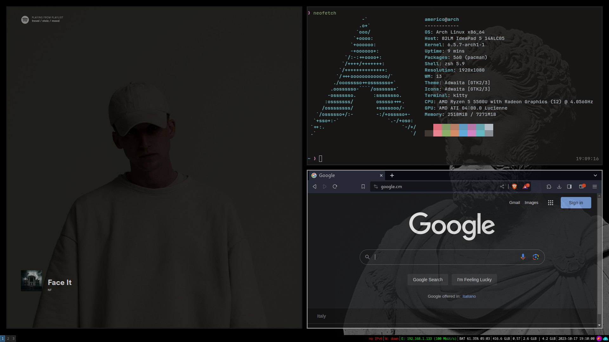
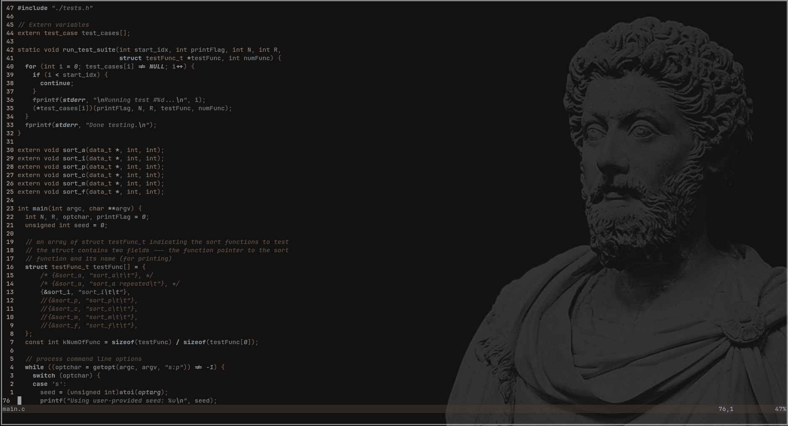
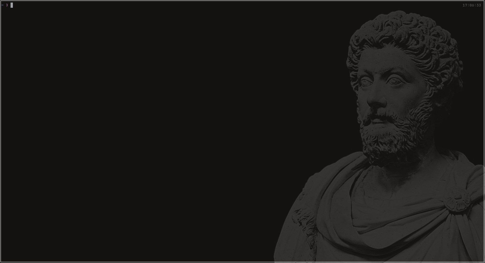

# .dotfiles

## Motivation
    This configuation was thought to be minimal and at the same
    time able to carry on sessions of programming with no problem whatsoever. 

## Contents
    - i3wm (window manager)
    - kitty (terminal emulator)
    - neovim (text editor)
    I will leave you some screenshots down below so that you can see if something 
    of this configuation may be useful for your own.

### i3wm

## neovim

# kitty 

